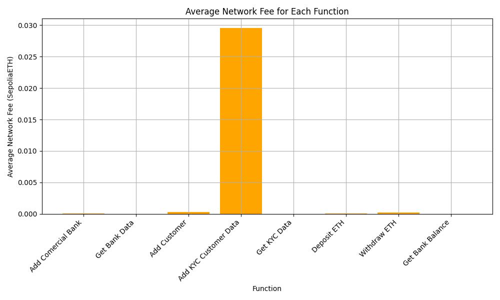

# Ethereum Bank Smart Contract with KYC System

This project implements a decentralized banking system on the Ethereum blockchain, integrating Know Your Customer (KYC) functionality. The system is designed to manage banks, customers, and user accounts while ensuring secure and efficient transactions. The smart contract is written in Solidity and includes features such as gas consumption tracking, transaction speed monitoring, and KYC compliance.

---

## Table of Contents
1. [Overview](#overview)
2. [Features](#features)
3. [Smart Contract Explanation](#smart-contract-explanation)
4. [System Architecture](#system-architecture)
5. [Performance Analysis](#performance-analysis)
6. [How to Use](#how-to-use)
7. [Visualizations](#visualizations)
8. [User Interface (UI) Walkthrough](#user-interface-ui-walkthrough)
9. [License](#license)

---

## Overview

The **Ethereum Bank Smart Contract with KYC** is a decentralized application (dApp) that allows:
- Central banks to manage commercial banks.
- Commercial banks to manage customer accounts and perform KYC.
- Users to register, deposit, and withdraw funds securely.

The system ensures transparency and security by leveraging blockchain technology and includes detailed performance metrics for gas usage, transaction speed, and network fees.

---

## Features

- **Central Bank Functions**:
  - Add and manage commercial banks.
  - Grant or revoke KYC privileges.
  - Allow or block customer addition by banks.

- **Commercial Bank Functions**:
  - Add customers and perform KYC.
  - Retrieve customer data and KYC status.

- **User Functions**:
  - Register users with detailed personal information.
  - Deposit and withdraw funds securely.
  - View account balances.

- **Utility Functions**:
  - String comparison and conversion utilities.
  - Fallback and receive functions for handling Ether transfers.

---

## Smart Contract Explanation

The core of the system is the `Bank_main.sol` smart contract, which defines the following key components:

### 1. **Structs**
- **Bank**: Represents a commercial bank with attributes like name, balance, KYC privileges, and customer addition permissions.
- **Customer**: Represents a customer with attributes like name, hash of customer data, validated bank, and KYC status.
- **User**: Represents a user with detailed personal information for KYC compliance.

### 2. **Mappings**
- `mapping(address => Bank) public banks`: Stores bank details.
- `mapping(string => Customer) public customersInfo`: Stores customer details.
- `mapping(address => User) private users`: Stores user details.

### 3. **Events**
The contract emits events for key actions, such as:
- `BankAdded`: When a new bank is added.
- `CustomerAdded`: When a new customer is added.
- `KYCCompleted`: When KYC is completed for a customer.
- `Deposit` and `Withdrawal`: For user transactions.
- `GasConsumption` and `ElapsedTime`: For performance tracking.

### 4. **Example Code Snippet**
Below is an example of the `addBank` function, which allows the central bank to add a new commercial bank:

```solidity
function addBank(string memory bankName, uint amount, address bankAddress) public onlyOwner {
    uint256 startGas = gasleft();
    uint256 startTime = block.timestamp;

    require(bankAddress != address(0), "Bank address cannot be zero address");
    require(!areStringSame(banks[bankAddress].name, bankName), "A Bank already exists with the same name");
    banks[bankAddress] = Bank(bankName, amount, bankAddress, true, true);
    emit BankAdded(bankName, amount, bankAddress);

    uint256 gasUsed = startGas - gasleft();
    uint256 timeTaken = block.timestamp - startTime;
    emit GasConsumption(gasUsed);
    emit ElapsedTime(timeTaken);
}
```

---

## System Architecture

The system is divided into three main layers:

1. **Central Bank**:
   - Acts as the administrator.
   - Manages commercial banks and their permissions.

2. **Commercial Banks**:
   - Manage customer accounts.
   - Perform KYC and validate customer data.

3. **Users**:
   - Register with personal details.
   - Deposit and withdraw funds.

The contract ensures that only authorized entities can perform specific actions, using modifiers like `onlyOwner` and `nonReentrant`.

---

## Performance Analysis

The system tracks performance metrics such as:
- **Gas Usage**: The amount of gas consumed for each operation.
- **Transaction Speed**: The time taken to execute each transaction.
- **Network Fees**: The cost of executing transactions on the Ethereum network.

### Example Visualizations
Below are some visualizations generated using the data from the smart contract:

#### 1. Average Gas Usage


#### 2. Average Network Fee


#### 3. Average Transaction Speed


#### 4. Function-Specific Gas Usage


#### 5. Function-Specific Network Fee


#### 6. Function-Specific Transaction Speed


---

## How to Use

1. **Deploy the Contract**:
   - Use a tool like Remix or Hardhat to deploy the `Bank_main.sol` contract on an Ethereum-compatible blockchain.

2. **Interact with the Contract**:
   - Use the provided functions to add banks, register users, and perform transactions.

3. **Analyze Performance**:
   - Use the data emitted by the contract to analyze gas usage, transaction speed, and network fees.

---

## Visualizations

The `Util/Plots.py` script generates performance visualizations using `matplotlib`. The script processes data from the smart contract and creates plots for metrics like gas usage, transaction speed, and network fees.

---

## User Interface (UI) Walkthrough

The following images provide a step-by-step walkthrough of the user interface for the Ethereum Bank Smart Contract with KYC system. These images demonstrate how users, banks, and administrators interact with the system.

### 1. **Home Page**
The home page provides an overview of the system, including options for users, banks, and administrators to navigate through the platform.


---

### 2. **User Registration**
Users can register by providing detailed personal information required for KYC compliance. This ensures that all users are verified before interacting with the system.


---

### 3. **Bank Dashboard**
The bank dashboard allows commercial banks to manage their accounts, add customers, and perform KYC operations.


---

### 4. **Add Bank**
The central bank can add new commercial banks to the system. This feature ensures that only authorized banks can operate within the platform.


---

### 5. **Add Customer**
Commercial banks can add new customers to their database. This step involves storing customer data securely on the blockchain.


---

### 6. **Complete KYC**
Banks can complete the KYC process for their customers. This ensures that customers are verified and eligible to perform transactions.


---

### 7. **Deposit Funds**
Users can deposit funds into their accounts. The system ensures secure and transparent transactions.


---

### 8. **Withdraw Funds**
Users can withdraw funds from their accounts. The system validates the user's balance and ensures secure withdrawals.


---

### 9. **Transaction History**
Users and banks can view the transaction history, including deposits, withdrawals, and KYC updates. This ensures transparency and accountability.


---

These images demonstrate the functionality and usability of the Ethereum Bank Smart Contract with KYC system. The UI is designed to be user-friendly and secure, ensuring a seamless experience for all participants.

---

## License

This project is licensed under the MIT License. See the `LICENSE` file for details.

---

## Acknowledgments

Special thanks to the Ethereum community for providing resources and tools to build decentralized applications.

